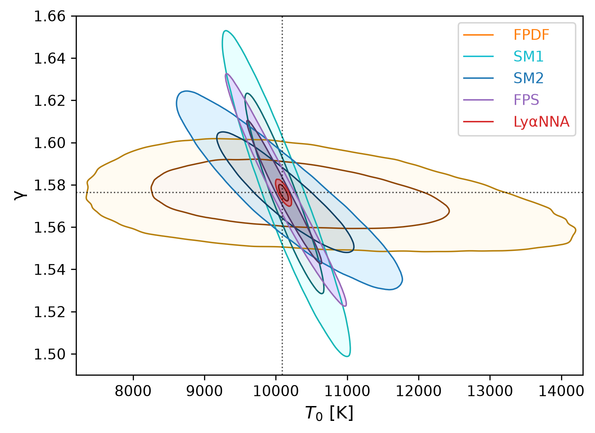
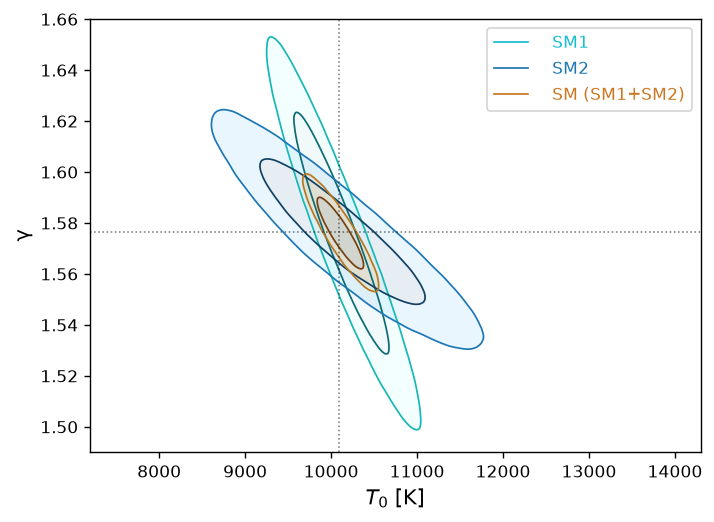
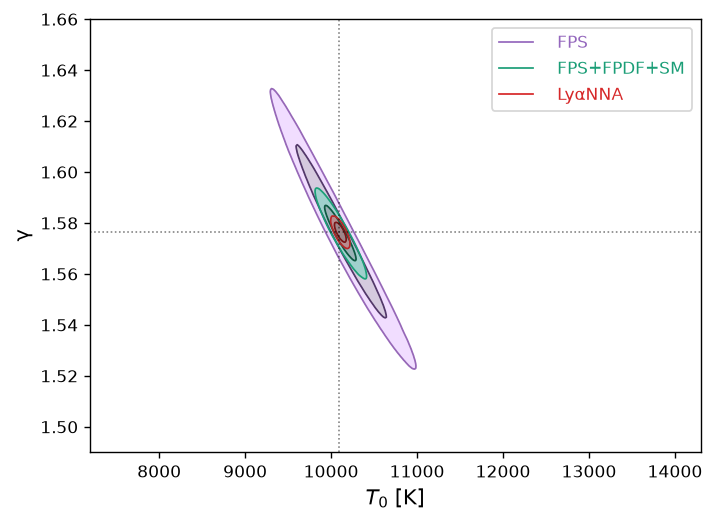

# HumanvsMachine


A lightweight repository for reproducing figures and tables used in the
paper:

[Human vs. machine – 1:3. Joint analysis of classical and ML-based
summary statistics of the Lyman-α
forest](https://arxiv.org/abs/2508.03264)

## Project Overview

This project contains code to load posterior chain data, generate
publication-style plots, and compute summary tables for model
comparison.

- `figures/fig02.py` — generate `Figure2.png`
- `figures/fig03.py` — generate `Figure3.png`
- `figures/fig04.py` — generate `Figure4.png`
- `figures/figB.1.py` — generate `FigureB.1.png`
- `figures/figC.1.py` — generate `FigureC.1.png`
- `figures/figC.2.py` — generate `FigureC.2.png`
- `figures/figD.1.py` — generate `FigureD.1.png`
- `figures/tables.py` — compute FoM/RCI tables and print summary output
- `src/hVsFigures/plotting.py` — reusable plotting utilities
- `src/hVsFigures/config.py` — central data and output paths plus
  plotting and inference settings
- `src/hVsFigures/infer_pipeline.py` — gain chains from the name list of
  summaries
- `src/hVsFigures/infer.py` — utilize the emcee package to perform
  MCMC-based inference
- `src/hVsFigures/information.py` — compute relative complementarity
  index and figure of merit ratios
- `src/hVsFigures/prepro.py` — preprocessing of summaries for inference

## Requirements

- Python 3.10+
- Dependencies listed in `requirements.txt`

Install dependencies:

``` bash
python3 -m pip install -r requirements.txt
```

Optionally install the package for editable imports:

``` bash
python3 -m pip install -e .
```

## Data

The scripts expect data under the repository `data/` directory.

- `data/ind_chains.pkl`
- `data/joint_chains/*.parquet`

Due to their large size, the data files are not included in this repository.
If you need the data to reproduce the results, please contact me for access.

## Usage

#### Generate each figure with:

### Figure 2

``` python
exec(open("figures/fig02.py").read())
```



### Figure 3

``` python
exec(open("figures/fig03.py").read())
```



### Figure 4

``` python
exec(open("figures/fig04.py").read())
```



#### Generate tables and print results with:

### Table 1

<!-- ```{python}
exec(open("figures/table01.py").read())
``` -->

``` python
from figures.table01 import table01
from IPython.display import display
display(table01())
```

<div>
<style scoped>
    .dataframe tbody tr th:only-of-type {
        vertical-align: middle;
    }
&#10;    .dataframe tbody tr th {
        vertical-align: top;
    }
&#10;    .dataframe thead th {
        text-align: right;
    }
</style>

|     | S           | FoM/FoM(LyαNNA) |
|-----|-------------|-----------------|
| 0   | FPS         | 0.079           |
| 1   | FPDF        | 0.006           |
| 2   | SM1         | 0.023           |
| 3   | SM2         | 0.017           |
| 4   | SM          | 0.114           |
| 5   | FPS+FPDF    | 0.240           |
| 6   | FPS+FPDF+SM | 0.283           |
| 7   | LyαNNA      | 1.000           |

</div>

### Table 2

<!-- ```{python}
exec(open("figures/table02.py").read())
``` -->

``` python
from figures.table02 import table02
from IPython.display import Markdown, display
display(Markdown(table02()))
```

|         |   fps |  fpdf | sm1_sm2 | lyanna |
|:--------|------:|------:|--------:|-------:|
| fps     | 1.000 | 0.977 |   0.517 |  0.021 |
| fpdf    | 0.668 | 1.000 |   0.169 |  0.004 |
| sm1_sm2 | 0.663 | 0.960 |   1.000 |  0.010 |
| lyanna  | 0.922 | 0.995 |   0.887 |  1.000 |
